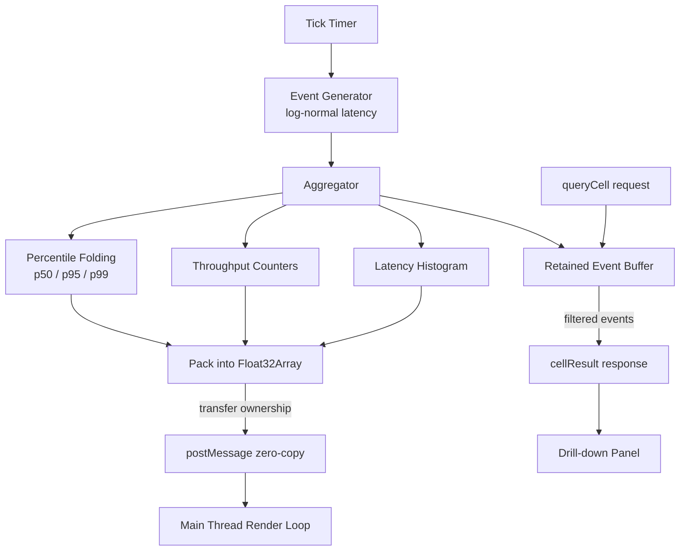
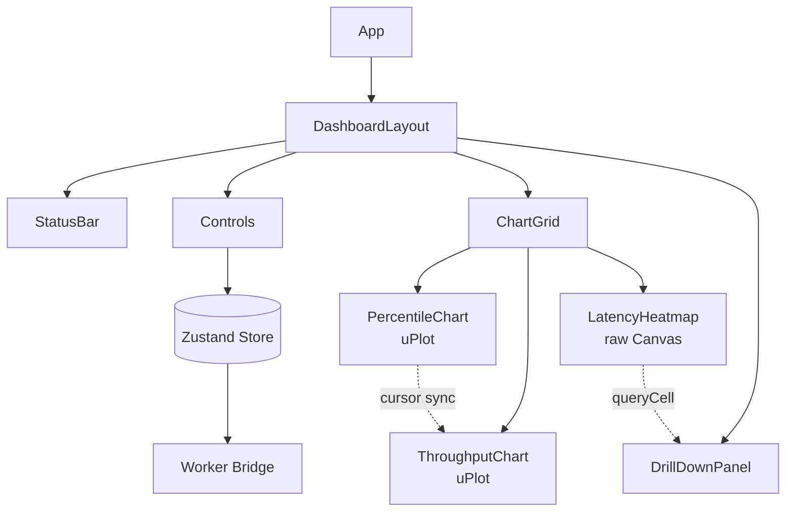

# A Thorn


```
   ___      _______ _                     _
  / _ \    |__   __| |                   | |
 / /_\ \      | |  | |__   ___  _ __ _ __| |
 |  _  |     | |  | '_ \ / _ \| '__| '_ \ |
 | | | |     | |  | | | | (_) | |  | | | |
 \_| |_/     |_|  |_| |_|\___/|_|  |_| |_|

     real-time observability, pure frontend
```

A real-time observability dashboard that runs **entirely in the browser**. No backend, no time-series database — a Web Worker simulates a production system, streams metrics through a zero-copy pipeline, and renders linked percentile charts, throughput graphs, and a drill-down latency heatmap at 60fps.

## Overview

A Thorn is a from-scratch answer to the question "what is a tool like Grafana actually doing?" The entire data plane — event generation, aggregation, and retention — lives in a single Web Worker. The main thread only renders. Communication happens over a narrow message protocol using **transferable `Float32Array` buffers** so no data is copied between threads. Latency is modeled as **log-normal** so the percentiles, tail, and heatmap behave like a real production system.

## Architecture

### Worker data pipeline



### React component tree



## Getting Started

```bash
git clone https://github.com/yourname/a-thorn.git
cd a-thorn
npm install
npm run dev
```

Open the printed local URL (default `http://localhost:5173`). Build for production with `npm run build`.

## Features

- ✅ Web Worker data pipeline (generator + aggregator + clock)
- ✅ Log-normal latency simulation for realistic tail behavior
- ✅ Zero-copy `Float32Array` transfer between worker and main thread
- ✅ Live p50 / p95 / p99 percentile chart (uPlot)
- ✅ Real-time throughput chart (uPlot)
- ✅ Hand-rolled Canvas latency heatmap
- ✅ Linked brushing & cursor sync across charts
- ✅ Click-to-drill-down via `queryCell` protocol
- ✅ Adjustable emit rate + anomaly injection controls
- ✅ Grafana/Figma-inspired dark theme
- ✅ 60fps under high simulated event rates

## Architecture Deep-Dive

**The Worker is the backend.** A single worker runs a fixed-interval tick. Each tick generates a batch of synthetic events, folds them into rolling aggregates, and posts results to the main thread. The main thread never aggregates — it only paints.

**Zero-copy transfer.** Aggregates are packed into `Float32Array`s and passed in `postMessage`'s transfer list, handing buffer ownership to the main thread instead of structured-cloning. The worker allocates fresh buffers each tick.

**Drill-down protocol.** Raw events are retained in the worker. Clicking a heatmap cell sends a `queryCell` message keyed by latency/time bucket; the worker filters its event buffer and returns matching events as a `cellResult`, populating the drill-down panel — mirroring aggregate-for-overview / detail-on-demand in real observability systems.

**Linked charts.** uPlot's `sync` API ties cursors across charts; brushing one chart calls `setSelect` on the others to narrow all views to the same time window.

## Tech Stack

| Layer | Technology | Why |
|---|---|---|
| Language | TypeScript 5 | Type-safe message protocols |
| UI framework | React 19 | Component model, concurrent rendering |
| Build tool | Vite 8 | Fast HMR, native worker imports |
| Charting | uPlot 1.x | Canvas-based, extremely fast at high data density |
| Heatmap | Raw Canvas 2D | Full control over cell color mapping |
| State management | Zustand 5 | Minimal, render-efficient global state |
| Data plane | Web Worker | Off-main-thread pipeline |
| Transport | Transferable buffers | Zero-copy `Float32Array` transfer |

## Design System

The dark theme is built from a small token set sourced from a Figma Make design export:

- **Surfaces** — layered near-black backgrounds (`#0a0a1a`, `#0d0d20`) for depth without pure black.
- **Accents** — restrained, low-saturation brand colors used sparingly.
- **Semantic latency scale** — green → amber → red, shared between CSS chrome and Canvas heatmap so "p99 is bad" looks the same everywhere.
- **Typography** — Inter (UI) + JetBrains Mono (data), 13px base.

Tokens live in a single `:root` block so the UI chrome and the Canvas rendering logic never disagree.

## What I Learned / Interview Talking Points

- **Web Workers as architecture, not afterthought** — using the worker boundary as a real data-plane/presentation-plane split.
- **The browser memory model** — transferable objects, buffer neutering, and why zero-copy matters per frame at high event rates.
- **Performance engineering** — sustaining a render loop under load; choosing Canvas over DOM at the right data density.
- **Statistical honesty** — log-normal latency and why p99 diverges from p50 in real systems.
- **Protocol design** — a typed request/response channel between threads (`queryCell` / `cellResult`).
- **The frontend ↔ platform seam** — building the thing that generates data, the thing that aggregates it, and the thing that draws it.

## License

MIT © Karabo Oliphant. See [LICENSE](LICENSE) for details.
